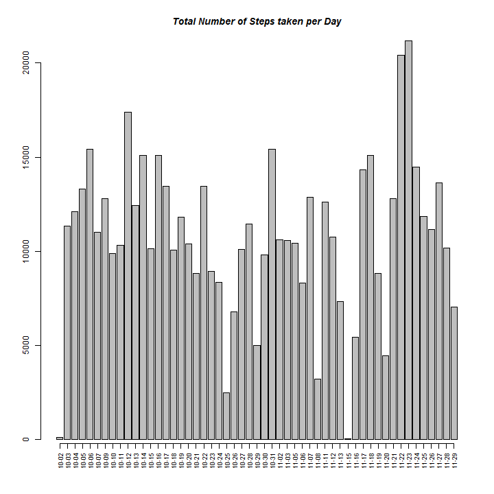

Activity Monitoring Data
========================================================

This is an R Markdown document. Markdown is a simple formatting syntax for authoring web pages (click the **Help** toolbar button for more details on using R Markdown).

We assume the following packages have been installed
data.table
kable
lattice

Loading and preprocessing the data

```r
library(data.table)
```

```
## Warning: package 'data.table' was built under R version 3.1.1
```
We need to set a path

```r
setwd('C:\\temp\\repdata-data-activity')
```

Lets read in the data and make this into data frame so its easaier to work with


```r
activity <- read.csv(file='C:\\temp\\repdata-data-activity\\activity.csv', header=T)

activitydf <- data.frame(Date=as.Date(as.character(activity$date, "%Y/%m/%d")), Steps=as.integer(activity$steps), Interval=as.integer(activity$interval))
```
What is mean total number of steps taken per day?

Now Lets calculate the total number of steps in a day with the aggregate package

```r
aggactivity <- aggregate(activitydf$Steps~activitydf$Date, FUN=sum)
```
Lets make a histogram of the total number of steps taken each day. Im going to make an axis of just month and day since all the data points have the same year.


```r
plot_counts <- barplot(as.vector(aggactivity[,2]))


dates <- gsub("2012-", "", aggactivity[,1])

axis(1,at=plot_counts,labels=dates, cex.axis=.75, las=2)

title(main = list("Total Number of Steps taken per Day", font = 4))
```

 

Lets Calculate and report the mean and median total number of steps taken per day


```r
aggactivitymean <- aggregate(activitydf$Steps~activitydf$Date, FUN=mean, na.rm=TRUE)

kable(aggactivitymean, format = "markdown")
```

```
## 
## 
## |activitydf$Date | activitydf$Steps|
## |:---------------|----------------:|
## |2012-10-02      |           0.4375|
## |2012-10-03      |          39.4167|
## |2012-10-04      |          42.0694|
## |2012-10-05      |          46.1597|
## |2012-10-06      |          53.5417|
## |2012-10-07      |          38.2465|
## |2012-10-09      |          44.4826|
## |2012-10-10      |          34.3750|
## |2012-10-11      |          35.7778|
## |2012-10-12      |          60.3542|
## |2012-10-13      |          43.1458|
## |2012-10-14      |          52.4236|
## |2012-10-15      |          35.2049|
## |2012-10-16      |          52.3750|
## |2012-10-17      |          46.7083|
## |2012-10-18      |          34.9167|
## |2012-10-19      |          41.0729|
## |2012-10-20      |          36.0938|
## |2012-10-21      |          30.6285|
## |2012-10-22      |          46.7361|
## |2012-10-23      |          30.9653|
## |2012-10-24      |          29.0104|
## |2012-10-25      |           8.6528|
## |2012-10-26      |          23.5347|
## |2012-10-27      |          35.1354|
## |2012-10-28      |          39.7847|
## |2012-10-29      |          17.4236|
## |2012-10-30      |          34.0938|
## |2012-10-31      |          53.5208|
## |2012-11-02      |          36.8056|
## |2012-11-03      |          36.7049|
## |2012-11-05      |          36.2465|
## |2012-11-06      |          28.9375|
## |2012-11-07      |          44.7326|
## |2012-11-08      |          11.1771|
## |2012-11-11      |          43.7778|
## |2012-11-12      |          37.3785|
## |2012-11-13      |          25.4722|
## |2012-11-15      |           0.1424|
## |2012-11-16      |          18.8924|
## |2012-11-17      |          49.7882|
## |2012-11-18      |          52.4653|
## |2012-11-19      |          30.6979|
## |2012-11-20      |          15.5278|
## |2012-11-21      |          44.3993|
## |2012-11-22      |          70.9271|
## |2012-11-23      |          73.5903|
## |2012-11-24      |          50.2708|
## |2012-11-25      |          41.0903|
## |2012-11-26      |          38.7569|
## |2012-11-27      |          47.3819|
## |2012-11-28      |          35.3576|
## |2012-11-29      |          24.4688|
```

The median of the total number of steps taken per day is:

```r
aggactivitymedian <- aggregate(activitydf$Steps~activitydf$Date, FUN=median, na.rm=TRUE)
kable(aggactivitymedian, format = "markdown")
```

```
## 
## 
## |activitydf$Date | activitydf$Steps|
## |:---------------|----------------:|
## |2012-10-02      |                0|
## |2012-10-03      |                0|
## |2012-10-04      |                0|
## |2012-10-05      |                0|
## |2012-10-06      |                0|
## |2012-10-07      |                0|
## |2012-10-09      |                0|
## |2012-10-10      |                0|
## |2012-10-11      |                0|
## |2012-10-12      |                0|
## |2012-10-13      |                0|
## |2012-10-14      |                0|
## |2012-10-15      |                0|
## |2012-10-16      |                0|
## |2012-10-17      |                0|
## |2012-10-18      |                0|
## |2012-10-19      |                0|
## |2012-10-20      |                0|
## |2012-10-21      |                0|
## |2012-10-22      |                0|
## |2012-10-23      |                0|
## |2012-10-24      |                0|
## |2012-10-25      |                0|
## |2012-10-26      |                0|
## |2012-10-27      |                0|
## |2012-10-28      |                0|
## |2012-10-29      |                0|
## |2012-10-30      |                0|
## |2012-10-31      |                0|
## |2012-11-02      |                0|
## |2012-11-03      |                0|
## |2012-11-05      |                0|
## |2012-11-06      |                0|
## |2012-11-07      |                0|
## |2012-11-08      |                0|
## |2012-11-11      |                0|
## |2012-11-12      |                0|
## |2012-11-13      |                0|
## |2012-11-15      |                0|
## |2012-11-16      |                0|
## |2012-11-17      |                0|
## |2012-11-18      |                0|
## |2012-11-19      |                0|
## |2012-11-20      |                0|
## |2012-11-21      |                0|
## |2012-11-22      |                0|
## |2012-11-23      |                0|
## |2012-11-24      |                0|
## |2012-11-25      |                0|
## |2012-11-26      |                0|
## |2012-11-27      |                0|
## |2012-11-28      |                0|
## |2012-11-29      |                0|
```
What is the average daily activity pattern?

Now lets generate results to determine the daily activity pattern. Let's make a time series line plot with 5-minute intervals (x-axis) and the average number of steps taken, averaged across all days (y-axis). Lets calculate the average over the intervals first. then plot it


```r
aggactivityintervalmean <- aggregate(activitydf$Steps~activitydf$Interval, FUN=mean, na.rm=TRUE)
```


```r
plot(aggactivityintervalmean[-1,1], aggactivityintervalmean[-1,2], type="l", xlab="Intervals", ylab="Average number of steps taken", col="blue")
```

 

To determine which interval contains the maximum number of steps I'll subset the interval mean results. By looking at the plot I can subset with 200 steps or more and output the intervals. The interval containing the max number of steps is:


```r
intervalsover200 <- subset(aggactivityintervalmean, aggactivityintervalmean[,2] > 200)

maxinterval <- intervalsover200[,1]

kable(intervalsover200, format = "markdown")
```

```
## 
## 
## |    | activitydf$Interval| activitydf$Steps|
## |:---|-------------------:|----------------:|
## |104 |                 835|            206.2|
```
The interval containing the max number of steps is: 835

Imputing missing values

If I want to know how many NAs there are in my data set then I will do a quick summary of my data frame:

```r
summary(activitydf)
```

```
##       Date                Steps          Interval   
##  Min.   :2012-10-01   Min.   :  0.0   Min.   :   0  
##  1st Qu.:2012-10-16   1st Qu.:  0.0   1st Qu.: 589  
##  Median :2012-10-31   Median :  0.0   Median :1178  
##  Mean   :2012-10-31   Mean   : 37.4   Mean   :1178  
##  3rd Qu.:2012-11-15   3rd Qu.: 12.0   3rd Qu.:1766  
##  Max.   :2012-11-30   Max.   :806.0   Max.   :2355  
##                       NA's   :2304
```
From this I can see that only the Steps column contains NAs so I'll run a Colsums function

```r
na_sums <- colSums(is.na(activitydf))
steps_sum <- na_sums[2]
```
 and I can see that Steps contains 2304 NA values.

Next we need to impute some missing values with average steps calculated per day.So will replace the NAs with the average from the following day. This address the issue with 10/1 which has no values before it. For 11-30 we will use the average from 11-29. The code below creates a new imputed dataframe with no NAs called imputedactivitydf 


```r
imputedactivitydf <- activitydf
imputedactivitydf$Steps[imputedactivitydf$Date =='2012-10-01'] <- "0.4375"
imputedactivitydf$Steps[imputedactivitydf$Date =='2012-10-08'] <- "44.48264"
imputedactivitydf$Steps[imputedactivitydf$Date =='2012-11-01'] <- "36.80556"
imputedactivitydf$Steps[imputedactivitydf$Date =='2012-11-04'] <- "36.24653"
imputedactivitydf$Steps[imputedactivitydf$Date =='2012-11-09'] <- "43.77778"
imputedactivitydf$Steps[imputedactivitydf$Date =='2012-11-10'] <- "43.77778"
imputedactivitydf$Steps[imputedactivitydf$Date =='2012-11-14'] <- "0.142361"
imputedactivitydf$Steps[imputedactivitydf$Date =='2012-11-30'] <- "24.46875"
```

Lets make a histogram of the total number of steps taken each day with the imputed data

```r
imputedaggactivitysum <- aggregate(as.numeric(imputedactivitydf$Steps)~imputedactivitydf$Date, FUN=sum)
```

```r
plot_countsimputed <- barplot(as.vector(imputedaggactivitysum[,2]))

datesimputed <- gsub("2012-", "", imputedaggactivitysum[,1])
                       
axis(1,at=plot_countsimputed,labels=datesimputed, cex.axis=.75, las=2)

title(main = list("Total Number of Steps taken per Day: Imputed Data", font = 4))
```

 

Lets Calculate and report the mean and median total number of steps taken per day with imputed data. The mean of the total number of steps taken per day from imputed data is:

```r
imputedaggactivitymean <- aggregate(as.numeric(imputedactivitydf$Steps)~imputedactivitydf$Date, FUN=mean, na.rm=TRUE)

imputedaggactivitymean
```

```
##    imputedactivitydf$Date as.numeric(imputedactivitydf$Steps)
## 1              2012-10-01                              0.4375
## 2              2012-10-02                              0.4375
## 3              2012-10-03                             39.4167
## 4              2012-10-04                             42.0694
## 5              2012-10-05                             46.1597
## 6              2012-10-06                             53.5417
## 7              2012-10-07                             38.2465
## 8              2012-10-08                             44.4826
## 9              2012-10-09                             44.4826
## 10             2012-10-10                             34.3750
## 11             2012-10-11                             35.7778
## 12             2012-10-12                             60.3542
## 13             2012-10-13                             43.1458
## 14             2012-10-14                             52.4236
## 15             2012-10-15                             35.2049
## 16             2012-10-16                             52.3750
## 17             2012-10-17                             46.7083
## 18             2012-10-18                             34.9167
## 19             2012-10-19                             41.0729
## 20             2012-10-20                             36.0938
## 21             2012-10-21                             30.6285
## 22             2012-10-22                             46.7361
## 23             2012-10-23                             30.9653
## 24             2012-10-24                             29.0104
## 25             2012-10-25                              8.6528
## 26             2012-10-26                             23.5347
## 27             2012-10-27                             35.1354
## 28             2012-10-28                             39.7847
## 29             2012-10-29                             17.4236
## 30             2012-10-30                             34.0938
## 31             2012-10-31                             53.5208
## 32             2012-11-01                             36.8056
## 33             2012-11-02                             36.8056
## 34             2012-11-03                             36.7049
## 35             2012-11-04                             36.2465
## 36             2012-11-05                             36.2465
## 37             2012-11-06                             28.9375
## 38             2012-11-07                             44.7326
## 39             2012-11-08                             11.1771
## 40             2012-11-09                             43.7778
## 41             2012-11-10                             43.7778
## 42             2012-11-11                             43.7778
## 43             2012-11-12                             37.3785
## 44             2012-11-13                             25.4722
## 45             2012-11-14                              0.1424
## 46             2012-11-15                              0.1424
## 47             2012-11-16                             18.8924
## 48             2012-11-17                             49.7882
## 49             2012-11-18                             52.4653
## 50             2012-11-19                             30.6979
## 51             2012-11-20                             15.5278
## 52             2012-11-21                             44.3993
## 53             2012-11-22                             70.9271
## 54             2012-11-23                             73.5903
## 55             2012-11-24                             50.2708
## 56             2012-11-25                             41.0903
## 57             2012-11-26                             38.7569
## 58             2012-11-27                             47.3819
## 59             2012-11-28                             35.3576
## 60             2012-11-29                             24.4688
## 61             2012-11-30                             24.4688
```

The median of the total number of steps taken per day from imputed data is:

```r
imputedaggactivitymedian <- aggregate(as.numeric(imputedactivitydf$Steps)~imputedactivitydf$Date, FUN=median, na.rm=TRUE)

imputedaggactivitymedian
```

```
##    imputedactivitydf$Date as.numeric(imputedactivitydf$Steps)
## 1              2012-10-01                              0.4375
## 2              2012-10-02                              0.0000
## 3              2012-10-03                              0.0000
## 4              2012-10-04                              0.0000
## 5              2012-10-05                              0.0000
## 6              2012-10-06                              0.0000
## 7              2012-10-07                              0.0000
## 8              2012-10-08                             44.4826
## 9              2012-10-09                              0.0000
## 10             2012-10-10                              0.0000
## 11             2012-10-11                              0.0000
## 12             2012-10-12                              0.0000
## 13             2012-10-13                              0.0000
## 14             2012-10-14                              0.0000
## 15             2012-10-15                              0.0000
## 16             2012-10-16                              0.0000
## 17             2012-10-17                              0.0000
## 18             2012-10-18                              0.0000
## 19             2012-10-19                              0.0000
## 20             2012-10-20                              0.0000
## 21             2012-10-21                              0.0000
## 22             2012-10-22                              0.0000
## 23             2012-10-23                              0.0000
## 24             2012-10-24                              0.0000
## 25             2012-10-25                              0.0000
## 26             2012-10-26                              0.0000
## 27             2012-10-27                              0.0000
## 28             2012-10-28                              0.0000
## 29             2012-10-29                              0.0000
## 30             2012-10-30                              0.0000
## 31             2012-10-31                              0.0000
## 32             2012-11-01                             36.8056
## 33             2012-11-02                              0.0000
## 34             2012-11-03                              0.0000
## 35             2012-11-04                             36.2465
## 36             2012-11-05                              0.0000
## 37             2012-11-06                              0.0000
## 38             2012-11-07                              0.0000
## 39             2012-11-08                              0.0000
## 40             2012-11-09                             43.7778
## 41             2012-11-10                             43.7778
## 42             2012-11-11                              0.0000
## 43             2012-11-12                              0.0000
## 44             2012-11-13                              0.0000
## 45             2012-11-14                              0.1424
## 46             2012-11-15                              0.0000
## 47             2012-11-16                              0.0000
## 48             2012-11-17                              0.0000
## 49             2012-11-18                              0.0000
## 50             2012-11-19                              0.0000
## 51             2012-11-20                              0.0000
## 52             2012-11-21                              0.0000
## 53             2012-11-22                              0.0000
## 54             2012-11-23                              0.0000
## 55             2012-11-24                              0.0000
## 56             2012-11-25                              0.0000
## 57             2012-11-26                              0.0000
## 58             2012-11-27                              0.0000
## 59             2012-11-28                              0.0000
## 60             2012-11-29                              0.0000
## 61             2012-11-30                             24.4688
```

```r
imputedaggactivityintervalmean <- aggregate(as.numeric(imputedactivitydf$Steps)~activitydf$Interval, FUN=mean, na.rm=TRUE)
```
One big difference is you can now see a median other than zero since the data set has been imputed.This is the biggest impact I see on the estimates of the total daily number of steps.

Are there differences in activity patterns between weekdays and weekends?

In order to make two plots we need to take the average number of steps taken averaged across all weekday days
or weekend days. To start, lets update our data set to reflect whether its a weekday or weekend.

```r
wdays <- weekdays(imputedactivitydf$Date)
wdays <- gsub("Monday", "weekdays", wdays)
wdays <- gsub("Tuesday", "weekdays", wdays)
wdays <- gsub("Wednesday", "weekdays", wdays)
wdays <- gsub("Thursday", "weekdays", wdays)
wdays <- gsub("Friday", "weekdays", wdays)
wdays <- gsub("Saturday", "weekends", wdays)
wdays <- gsub("Sunday", "weekends", wdays)
```

Next lets create a new factor variable in the dataset with two levels - "weekday" and "weekend" indicating whether a given date is a weekday or weekend day. Then we will subset our factor data by weekday and weekends.From there we can aggregate and calculate the mean steps over intervals for both weekdays and weekends.

```r
fwdays <- factor(wdays)

imputedactivitydfwdays <- cbind(imputedactivitydf, fwdays)


weekdaysimputed <- subset(imputedactivitydfwdays, imputedactivitydfwdays[,4] =='weekdays')

weekendsimputed <- subset(imputedactivitydfwdays, imputedactivitydfwdays[,4] =='weekends')

imputedaggactivityintervalmeanweekdays <- aggregate(as.numeric(weekdaysimputed$Steps)~weekdaysimputed$Interval, FUN=mean, na.rm=TRUE)

imputedaggactivityintervalmeanweekends <- aggregate(as.numeric(weekendsimputed$Steps)~weekendsimputed$Interval, FUN=mean, na.rm=TRUE)
```
Next lets make a panel plot containing a time series plot of the 5-minute interval and the average data calculated above.


```r
par(mfrow=c(2,1))

plot(imputedaggactivityintervalmeanweekdays[-1,1],imputedaggactivityintervalmeanweekdays[-1,2], type="l", xlab="Intervals", ylab="Steps taken: Weekdays", col="blue")

plot(imputedaggactivityintervalmeanweekends[-1,1],imputedaggactivityintervalmeanweekends[-1,2], type="l", xlab="Intervals", ylab="Steps taken: Weekends", col="green")
```

 
Now lets make the plot again but with lattice. 

```r
par(mfrow=c(2,1))
library(lattice)

panel.smoother <- function(x, y) {
  panel.xyplot(x, y) # show points 
  panel.loess(x, y)  # show smoothed line 
}

xyplot(imputedaggactivityintervalmeanweekdays[-1,2]~imputedaggactivityintervalmeanweekdays[-1,1],scales=list(cex=.8, col="blue"), panel=panel.smoother,xlab="Intervals", ylab="Steps taken: Weekdays", col="blue")
```

 

```r
xyplot(imputedaggactivityintervalmeanweekends[-1,2]~imputedaggactivityintervalmeanweekends[-1,1],scales=list(cex=.8, col="blue"), panel=panel.smoother,xlab="Intervals", ylab="Steps taken: Weekends", col="blue")
```

 


You can see that there is consistently more steps taken across intervals in the weekend. For weekdays you see can two peaks and then it tappers of. Perhaps these peaks are when folks are going to work?

